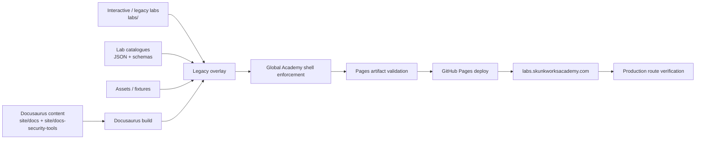
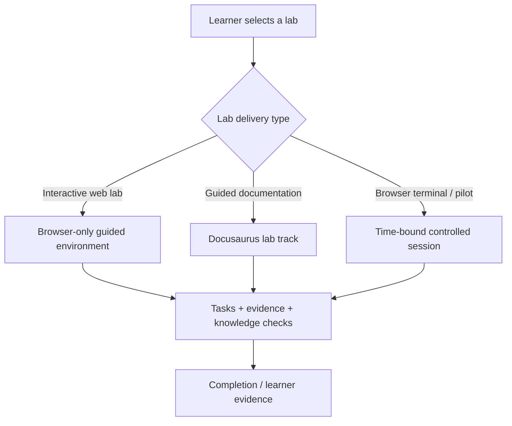
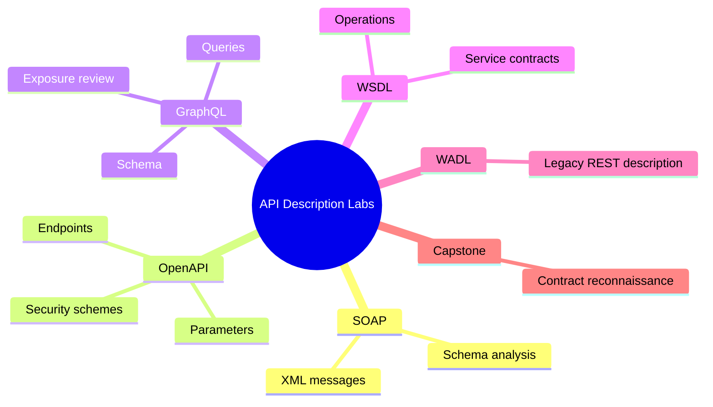
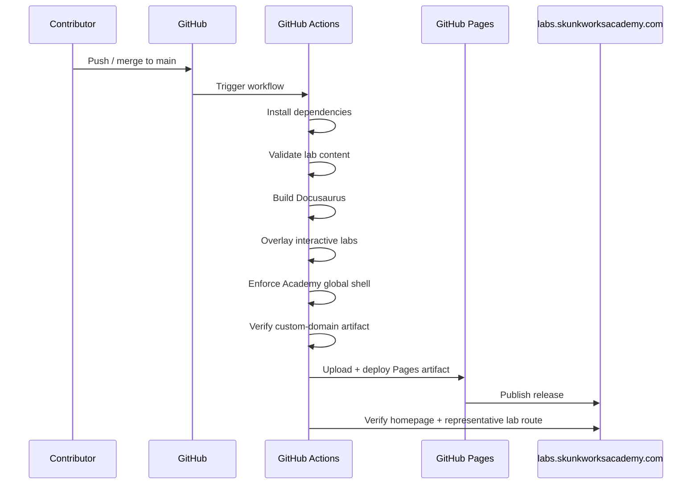

<div align="center">

<picture>
  <source media="(prefers-color-scheme: dark)" srcset="assets/icons/favicon-white.png">
  <source media="(prefers-color-scheme: light)" srcset="assets/icons/favicon-black.png">
  
</picture>

# Skunkworks Academy Labs

### Practical, evidence-led technical learning environments

**Browser labs · Security validation · API analysis · Cloud · Networking · Linux · Digital forensics · Secure collaboration**

[](https://labs.skunkworksacademy.com/)
[](https://github.com/skunkworks-academy/labs/actions/workflows/static.yml)
[](https://docusaurus.io/)
[](https://nodejs.org/)
[](https://labs.skunkworksacademy.com/)
[](LICENSE)

[**Launch Labs**](https://labs.skunkworksacademy.com/) · [**Academy**](https://skunkworksacademy.com/) · [**Learner Portal**](https://portal.skunkworksacademy.com/) · [**Course Catalogue**](https://catalog.skunkworksacademy.com/)

</div>

---

## What this repository is

`skunkworks-academy/labs` is the source repository for **Skunkworks Academy Labs** at **https://labs.skunkworksacademy.com/**.

It combines a modern **Docusaurus learning site** with a growing collection of **interactive browser labs**, **security-tool exercises**, **API-description labs**, supporting schemas, catalog metadata, fixtures and deployment automation.

The repository is designed around four operating principles:

| Principle | What it means |
|---|---|
| 🧪 **Hands-on first** | Learners work through practical tasks, evidence, decision points and guided exercises rather than passive reading alone. |
| 🛡️ **Safe by design** | Security exercises use controlled targets, synthetic evidence, bounded scenarios or isolated future-runtime patterns. |
| 📋 **Evidence-led** | Labs emphasise reproducible observations, provenance, least privilege, authorised actions and defensible conclusions. |
| 🚀 **Deployable learning** | Content is built, validated and published automatically through GitHub Actions and GitHub Pages. |

---

## Lab portfolio at a glance

<table>
<tr>
<td width="33%" valign="top">

### 🧭 Core & Interactive Labs

**16 catalogue entries**

Linux, networking, binary fundamentals, identity, cloud, Azure, Google Cloud, Git/GitHub, SQL, phishing triage and digital forensics.

➡️ [`lab-catalog.json`](lab-catalog.json)

</td>
<td width="33%" valign="top">

### 🛡️ Security Tool Labs

**14 guided labs**

OpenVAS, Nmap NSE, Burp Suite, OWASP ZAP, Nikto, Wapiti, WPScan, Droopescan, CMSmap, Aircrack-ng, Kismet, Lynis, Metasploit and an integrated capstone.

➡️ [`site/static/security-tool-labs.json`](site/static/security-tool-labs.json)

</td>
<td width="33%" valign="top">

### 🔌 API Description Labs

**6 guided labs**

SOAP, Swagger/OpenAPI, GraphQL, WSDL, WADL and an API contract reconnaissance capstone.

➡️ [`site/static/api-description-labs.json`](site/static/api-description-labs.json)

</td>
</tr>
</table>

### Featured interactive labs

| Code | Lab | Level | Duration | Delivery |
|---|---|---:|---:|---|
| `LAB-DAT-101` | Bits, Bytes & Binary Fundamentals | Beginner | 25 min | Interactive web lab |
| `LAB-NET-101` | IPv4 Subnetting Foundations | Beginner | 35 min | Interactive web lab |
| `LAB-REM-201` | REMnux Triage & Memory Forensics | Intermediate | 55 min | Browser simulation |
| `LAB-FLR-201` | FLARE VM Analysis Workbench | Intermediate | 60 min | Browser simulation |
| `LAB-KAL-201` | Kali Linux Evidence & Network Forensics | Intermediate | 55 min | Browser simulation |
| `LAB-NET-201` | Wireshark PCAP Investigation | Intermediate | 60 min | Interactive web lab |
| `LAB-ID-101` | Entra ID, MFA and Conditional Access | Beginner–Intermediate | 60 min | Interactive web lab |
| `LAB-AZ-101` | Azure Landing Zone Essentials | Beginner–Intermediate | 60 min | Interactive web lab |
| `LAB-GCP-101` | Google Cloud IAM and FinOps Guardrails | Beginner–Intermediate | 60 min | Interactive web lab |
| `LAB-DEV-101` | Git, GitHub and Secure Collaboration | Beginner–Intermediate | 60 min | Interactive web lab |

> The machine-readable catalogue is the source of truth for availability, delivery mode, duration, objectives, network policy and runtime constraints.

---

## Repository architecture



The deployment pipeline deliberately validates both the **Docusaurus-generated pages** and representative **overlaid interactive lab routes** before a release is treated as complete.

---

## How the site is assembled

```text
skunkworks-academy/labs/
│
├── .github/workflows/       # CI, validation and GitHub Pages deployment
├── .well-known/             # Well-known web metadata
├── _includes/               # Shared/static HTML include material
├── assets/                  # Brand, navigation and lab assets
├── catalog/                 # Supporting catalogue content
├── docs/                    # Repository-level documentation
├── labs/                    # Interactive and legacy browser labs
├── schemas/                 # Machine-readable validation schemas
├── scripts/                 # Repository validators and automation
├── self-paced/              # Self-paced coding and security material
│   ├── coding/
│   └── security/
├── site/                    # Docusaurus application
│   ├── docs/                # API-description track
│   ├── docs-security-tools/ # Security-tool track
│   ├── scripts/             # Docusaurus build/overlay utilities
│   ├── src/                 # UI and styling
│   └── static/              # Static catalogues, fixtures, CNAME, .nojekyll
├── CNAME                    # labs.skunkworksacademy.com
├── index.html               # Legacy/static landing source
├── lab-catalog.json         # Primary interactive lab catalogue
├── robots.txt
├── sitemap.xml
└── site.webmanifest
```

---

## Delivery model

The repository currently supports several deliberately different lab modes.



### Security boundary

This repository is **training infrastructure**, not an unrestricted exploitation platform.

- Browser simulations use synthetic or pre-recorded evidence where appropriate.
- Malware-analysis labs do not enable untrusted sample execution in the public browser experience.
- Kali forensic exercises separate read-only examination from live enumeration.
- Security scanning labs are framed around authorised, controlled lab targets.
- Public SSH is disabled for catalogue entries that declare that control.
- Future VM-backed modes are described as instructor-managed and isolated where applicable.

> **Authorisation matters:** only perform scanning, testing, exploitation, reverse engineering or forensic work against systems, data and environments you are explicitly authorised to use.

---

## Security-tool track

The Docusaurus security track provides guided learning for:

| Domain | Tools / labs |
|---|---|
| Network vulnerability scanning | OpenVAS / Greenbone, Nmap NSE |
| Web application assessment | Burp Suite, OWASP ZAP, Nikto, Wapiti |
| CMS assessment | WPScan, Droopescan, CMSmap |
| Wireless analysis | Aircrack-ng, Kismet |
| Linux auditing | Lynis |
| Controlled validation | Metasploit Framework |
| Applied assessment | Integrated Security Assessment Capstone |

**Start here:** [`/labs/security-tools/`](https://labs.skunkworksacademy.com/labs/security-tools/)

---

## API-description track

The API track focuses on understanding and safely analysing machine-readable service contracts.



**Start here:** [`/labs/api-description/`](https://labs.skunkworksacademy.com/labs/api-description/)

---

## Local development

The Docusaurus application lives under [`site/`](site/).

### Requirements

- Node.js **24** recommended for parity with CI
- npm
- Git

### Run the Docusaurus site

```bash
git clone https://github.com/skunkworks-academy/labs.git
cd labs/site
npm install --no-audit --no-fund
npm run start
```

### Build the deployable site

```bash
cd site
npm run build:deploy
```

`build:deploy` validates the security-tool content, builds Docusaurus and overlays the existing interactive lab assets into the final `site/build` output.

---

## CI/CD and release controls

The production site is deployed through [`Build and deploy Docusaurus to Pages`](.github/workflows/static.yml).



### Current controls

- GitHub Pages deployment uses the repository's verified custom domain.
- HTTPS is enforced by GitHub Pages.
- The build validates that `CNAME` remains `labs.skunkworksacademy.com`.
- The canonical Skunkworks Academy navigation/footer shell is injected and verified across generated HTML.
- Production verification checks both the main Docusaurus output and a representative interactive lab route.
- Mandatory page-head validation protects committed static HTML pages.

---

## Lab metadata model

A lab record is designed to capture more than a title and URL. Depending on the track, metadata can include:

```json
{
  "code": "LAB-NET-201",
  "title": "Wireshark PCAP Investigation",
  "availability": "available-now",
  "delivery": "interactive-web-lab",
  "durationMinutes": 60,
  "level": "intermediate",
  "networkPolicy": "no-runtime-required",
  "publicSsh": false,
  "objectives": [
    "Identify bounded packet events",
    "Use reproducible filter logic",
    "Separate observations from conclusions",
    "Record authorised follow-up"
  ]
}
```

This metadata supports catalogue rendering, validation, learner guidance, entitlement design and future platform integrations.

---

## Adding or improving a lab

1. **Choose the correct track** — interactive/static lab, security-tool Docusaurus track, API-description track, or self-paced material.
2. **Assign a stable lab code** following the existing `LAB-<DOMAIN>-<LEVEL>` pattern.
3. **Define outcomes first** — objectives should describe what the learner can demonstrate after completing the lab.
4. **Declare safety boundaries** — delivery mode, network policy, runtime expectations and authorisation assumptions must be explicit.
5. **Add evidence-led tasks** — learners should observe, interpret, record and justify rather than merely click through instructions.
6. **Update the relevant catalogue** and route metadata.
7. **Run validation and build locally** before opening a pull request.
8. **Preserve the Academy global shell** and required page metadata on public HTML.

---

## Quality checklist

- [ ] Lab has a unique code and descriptive title
- [ ] Learning objectives are measurable
- [ ] Level and expected duration are defined
- [ ] Delivery/runtime model is explicit
- [ ] Security and authorisation boundaries are documented
- [ ] Instructions use synthetic or controlled targets where required
- [ ] Evidence or learner output is defined
- [ ] Links and routes resolve correctly
- [ ] Mobile/browser experience is usable
- [ ] Accessibility and keyboard interaction are considered
- [ ] Catalogue metadata is updated
- [ ] Local validation/build passes
- [ ] GitHub Actions checks pass
- [ ] Production route is verified after deployment

---

## Useful repository entry points

| Resource | Purpose |
|---|---|
| [`lab-catalog.json`](lab-catalog.json) | Main interactive/general lab catalogue |
| [`site/static/security-tool-labs.json`](site/static/security-tool-labs.json) | Security-tool lab catalogue |
| [`site/static/api-description-labs.json`](site/static/api-description-labs.json) | API-description lab catalogue |
| [`site/docusaurus.config.js`](site/docusaurus.config.js) | Docusaurus site configuration |
| [`site/scripts/overlay-legacy.mjs`](site/scripts/overlay-legacy.mjs) | Overlays interactive/legacy lab assets into the Docusaurus build |
| [`scripts/validate-mandatory-head.js`](scripts/validate-mandatory-head.js) | Validates required metadata on committed HTML |
| [`.github/workflows/static.yml`](.github/workflows/static.yml) | Production Pages build/deploy/verification pipeline |
| [`CNAME`](CNAME) | Production custom-domain declaration |

---

## Platform links

<div align="center">

| Learn | Practise | Manage | Explore |
|---|---|---|---|
| [Course Catalogue](https://catalog.skunkworksacademy.com/) | [Labs](https://labs.skunkworksacademy.com/) | [Learner Portal](https://portal.skunkworksacademy.com/) | [Skunkworks Academy](https://skunkworksacademy.com/) |

</div>

---

## Contributing

Contributions should preserve the repository's learning, safety and operational standards. Keep changes focused, testable and reviewable. When changing public lab content, include enough context in the pull request for a reviewer to understand:

- the learner outcome being improved;
- routes/files changed;
- validation performed;
- security or runtime implications;
- screenshots or evidence for meaningful UI changes;
- rollback considerations where deployment behaviour changes.

For substantial new lab tracks, prefer a proposal that defines the taxonomy, lab-code range, delivery model and validation approach before adding large volumes of content.

---

## Licence

This repository is distributed under the terms in [`LICENSE`](LICENSE).

Training content may reference third-party technologies, tools and trademarks. Those names remain the property of their respective owners. References are educational and do not imply endorsement unless explicitly stated.

---

<div align="center">

### Learn today. Lead tomorrow.

**Skunkworks Academy** · Practical skills · Verifiable evidence · Responsible technology learning

[Website](https://skunkworksacademy.com/) · [Labs](https://labs.skunkworksacademy.com/) · [Portal](https://portal.skunkworksacademy.com/) · [GitHub Organisation](https://github.com/skunkworks-academy)

</div>
